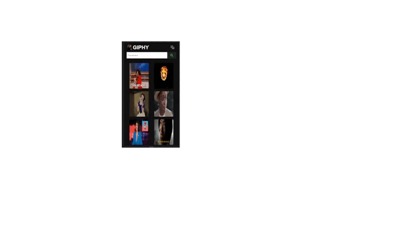

## 🔗 Sobre o Projeto

AINDA ESTÁ EM DESENVOLVIMENTO.

Deploy: https://giphy-clone-hiroto.netlify.app/

Esse é um projeto consumindo uma API do site GIPHY. Ao entrar na página inicial, você encontrará um search (campo para pesquisar) podendo pesquisar vários e vários tipos de Gifs do seu gosto. É só digitar e buscar.

## 💻 Pagina Home
 

## 💻 Coleções

Estando na página inicial ou em qualquer outra, você vai poder navegar entre as páginas de categorias: Sports, Stickers, Artists e Anime. 

 

## 💻 Dashboard

Em qualquer página, você pode clicar em cima de um gif que lhe chamou atenção e será enviado para uma página com informações sobre o gif. Nessa página terá o GIF em tamanho maior, o nome do autor do gif, a descrição e instagram do autor. Além de ter um botão onde você pode clicar e irá copiar o link do gif, podendo enviar para algum amigo. Vale ressaltar que nem todos os GIFS terão descrição ou as informações completas! 

 

## 📱 Responsivo

A página é totalmente responsiva, podendo ser acessada em qualquer dispositivo.

 

 

## 👨‍💻 Tecnologias utilizadas
 

- Javascript
- React Js
- SASS
 

## 🎮 Implantação em produção

- Web de front-end: Netlify
- Flexbox
- Hooks
- Axios
- Context API
- API REST

## 📓 Bibliotecas Utilizadas

- Font Awesome
- Animated CSS burguers
- React Router Dom
 

## 🧑 Autor
 

Ângelo Gustavo Pereira da Silva

Linkedin: www.linkedin.com/in/souangelogustavo

E-mail: angelotj43@gmail.com
